# Swarm Suite

**A multi-agent MCP toolkit that takes a Python project from idea to production.** Seven tools collaborate through a shared knowledge base to capture ideas, architect, plan, review, fix, document, harden, and release your code -- enforcing **SOLID + DRY** at every stage.

> Python-first and language-agnostic for everything below the spec layer. Embedded / industrial projects get an **optional** Stage 0 (`spec-swarm`) for datasheet + protocol analysis; everything else runs by default and works for any Python codebase.

```
                       +-----------------+
                       |   swarm-core    |  shared foundation:
                       |  models         |    models, ExpertRegistry,
                       |  experts        |    SessionLifecycle,
                       |  coordination   |    MessageBus / EventBus /
                       |  skills         |    PhaseBarrier / RateLimiter /
                       |  mcp / keeper   |    CompletionTracker, MCPApp,
                       |  textmatch      |    Jaccard task<->skill matching
                       +--------+--------+
                                |
                       +--------v--------+
                       |    swarm-kb     |  storage + coordination:
                       |  findings       |    findings, decisions, debates,
                       |  decisions      |    judgings (CouncilAsAJudge),
                       |  debates (x13)  |    verifications, pgve sessions,
                       |  judgings       |    flows (AgentRearrange DSL),
                       |  verifications  |    pipelines, code maps,
                       |  pgve / flows   |    cross-refs, quality gate,
                       |  pipelines      |    cross-process file locks
                       +-+-+-+-+-+-+-+-+-+
                         | | | | | | | |
       +-----+-----+-----+ | | | | | | +-----+-----+
       |     |     |     | | | | | |   |     |     |
       v     v     v     v v v v v v   v     v     v
     Idea  Spec  Arch  Plan  Review Fix Verify Doc Hard Release
     (kb) (spec)(arch) (kb)  (rev) (fix)(fix) (doc)(kb) (kb)
                                                         ^
                            "Idea -> Production" pipeline
```

## About

The suite was originally built for developers writing **industrial / embedded software**, where hardware specs (registers, pin maps, fieldbus protocols) need to align with the code architecture. That use case is still first-class via `spec-swarm`.

But the rest of the pipeline -- multi-agent architecture debates, multi-expert code review, fix-with-consensus, generate-verify-retry loops, the 13-format debate library, the AgentRearrange-style flow DSL, task-conditioned skill composition -- turned out general enough that **any Python project benefits**. Spec-swarm is opt-in (`include_spec=True`); everything else runs by default.

## Packages

Universal Python tooling (run by default):

| Package | Description | Install |
|---------|-------------|---------|
| **swarm-core**   | Shared foundation: models, expert registry, session lifecycle, coordination primitives, MCP scaffolding, CLAUDE.md keeper | `pip install swarmsuite-core` |
| **swarm-kb**     | Shared knowledge base -- findings, decisions, debates, judgings, verifications, pgve sessions, flow DSL, pipelines, code maps | `pip install swarm-kb` |
| **ArchSwarm**    | Multi-agent architecture debates -- coupling, modularity, scalability, SOLID-grounded designs | `pip install arch-swarm-ai` |
| **ReviewSwarm**  | Multi-agent code review -- 13 experts (security, performance, threading, SOLID/DRY violations, ...) | `pip install review-swarm` |
| **FixSwarm**     | Multi-agent code fixer -- propose, consensus, apply, regression-check; refuses fixes that move away from SOLID+DRY | `pip install fix-swarm-ai` |
| **DocSwarm**     | Documentation generator + ADR maintainer -- API docs, verification, SOLID/DRY trade-off justifications | `pip install doc-swarm-ai` |

Optional add-on for embedded / industrial projects:

| Package | Description | Install |
|---------|-------------|---------|
| **SpecSwarm**    | Hardware spec analyzer -- datasheets, register maps, CAN/CANopen/EtherCAT/PROFINET/Modbus/OPC UA. Activates Stage 0 of the pipeline (`include_spec=True`). Skip if you're not writing firmware / instrument software. | `pip install spec-swarm-ai` |

All packages live in this monorepo under `packages/` but ship to PyPI independently. The shared code lives in `swarm-core`; layering enforced by `scripts/check_imports.py`.

## Quick Start

### Install

```bash
# Default install -- universal Python tooling (skip spec-swarm if you're not on embedded)
pip install swarmsuite-core swarm-kb arch-swarm-ai review-swarm fix-swarm-ai doc-swarm-ai

# Embedded / industrial projects: add the spec analyzer
pip install spec-swarm-ai
pip install spec-swarm-ai[pdf]                 # for PDF datasheet ingestion

# Monorepo dev install (editable, dependency-ordered)
git clone https://github.com/fozzfut/swarm-suite
cd swarm-suite
python scripts/install_all.py
```

> **Naming note:** the foundation package is `swarmsuite-core` on PyPI (the shorter `swarm-core` was rejected as too similar to existing `swarms`). The Python import name remains `swarm_core` -- code and docs unchanged.

To verify the install: `python scripts/verify_e2e.py --quick` -- runs 47 end-to-end checks across CLIs, MCP server wiring, every new pipeline stage, prompt composition, and migration-script idempotency.

### Add MCP servers (Claude Code)

```bash
# Universal set
claude mcp add swarm-kb     -- swarm-kb serve --transport stdio
claude mcp add arch-swarm   -- arch-swarm serve --transport stdio
claude mcp add review-swarm -- review-swarm serve --transport stdio
claude mcp add fix-swarm    -- fix-swarm serve --transport stdio
claude mcp add doc-swarm    -- doc-swarm serve --transport stdio

# Embedded / industrial only
claude mcp add spec-swarm   -- spec-swarm serve --transport stdio
```

### Add MCP servers (Cursor / Windsurf / Cline)

```json
{
  "mcpServers": {
    "swarm-kb":     { "url": "http://localhost:8788/sse" },
    "arch-swarm":   { "url": "http://localhost:8768/sse" },
    "review-swarm": { "url": "http://localhost:8765/sse" },
    "fix-swarm":    { "url": "http://localhost:8767/sse" },
    "doc-swarm":    { "url": "http://localhost:8766/sse" },
    "spec-swarm":   { "url": "http://localhost:8769/sse" }
  }
}
```

## Pipeline Workflow

A **10-stage pipeline** (idea -> production) with **user gates** between every stage. You control the pace -- no automatic progression. Several stages are *optional*: skip Idea/Plan if you already have a design, skip Spec if you're not on embedded.

The diagram below renders natively on GitHub (Mermaid). Light blue boxes are optional; the dashed loop on Fix is the quality-gate retry until the suite emits `stop_clean` or `stop_circuit_breaker`. Every solid arrow crosses an explicit user gate (`kb_advance_pipeline`).

```mermaid
flowchart TD
    Start([Project start])
    GreenfieldQ{Greenfield<br/>project?}
    Idea["Stage 0a: Idea<br/>brainstorming -> design.md<br/><i>swarm-kb</i>"]
    EmbeddedQ{Embedded /<br/>industrial?}
    Spec["Stage 0b: Spec<br/>datasheets -> hw constraints<br/><i>spec-swarm</i>"]
    Arch["Stage 1: Architecture<br/>scan + multi-agent debates -> ADRs<br/><i>arch-swarm</i>"]
    PlanQ{Want TDD-grade<br/>executable plan?}
    Plan["Stage 2: Plan<br/>ADRs -> 2-5 min tasks, tests-first<br/><i>swarm-kb</i>"]
    Review["Stage 3: Review<br/>13 experts + cross-check phase<br/><i>review-swarm</i>"]
    Fix["Stage 4: Fix<br/>propose -> consensus -> apply<br/><i>fix-swarm</i>"]
    Gate{Quality gate}
    Manual["Manual review<br/>fix cycle unstable"]
    Verify["Stage 5: Verify<br/>regression + VerificationReport<br/><i>fix-swarm</i>"]
    Doc["Stage 6: Doc<br/>verify stale + generate API ref<br/><i>doc-swarm</i>"]
    Hard["Stage 7: Hardening<br/>mypy / coverage / pip-audit / secrets<br/><i>swarm-kb</i>"]
    Release["Stage 8: Release<br/>version bump + changelog + dist<br/><i>swarm-kb</i>"]
    End([Production-ready])

    Start --> GreenfieldQ
    GreenfieldQ -- yes --> Idea
    GreenfieldQ -- no --> EmbeddedQ
    Idea --> EmbeddedQ
    EmbeddedQ -- yes --> Spec
    EmbeddedQ -- no --> Arch
    Spec --> Arch
    Arch --> PlanQ
    PlanQ -- yes --> Plan
    PlanQ -- no --> Review
    Plan --> Review
    Review --> Fix
    Fix --> Gate
    Gate -- continue --> Review
    Gate -- stop_circuit_breaker --> Manual
    Gate -- stop_clean --> Verify
    Verify --> Doc
    Doc --> Hard
    Hard --> Release
    Release --> End

    classDef optional fill:#e1f5ff,stroke:#1976d2,color:#0d47a1
    classDef required fill:#f3f3f3,stroke:#424242,color:#212121
    classDef alarm fill:#ffe1e1,stroke:#c62828,color:#b71c1c
    classDef terminal fill:#e8f5e9,stroke:#2e7d32,color:#1b5e20
    class Idea,Spec,Plan optional
    class Arch,Review,Fix,Verify,Doc,Hard,Release required
    class Manual alarm
    class Start,End terminal
```



Stages at a glance:

```
0a. Idea         (kb)         optional: greenfield brainstorming -> design.md
0b. Spec         (spec-swarm) optional: datasheet / protocol extraction (embedded)
1.  Architecture (arch-swarm) coupling, complexity, debates -> ADRs
2.  Plan         (kb)         optional: ADRs -> TDD-grade executable plan
3.  Review       (review)     13 experts, cross-check phase, decision compliance
4.  Fix          (fix)        propose-consensus-apply with quality gate
5.  Verify       (fix)        regression check, optional VerificationReport
6.  Doc          (doc)        verify stale docs, generate API reference
7.  Hardening    (kb)         mypy strict / coverage / pip-audit / secrets / CI
8.  Release      (kb)         version bump, changelog, validate pyproject, build dist
```

```
kb_start_pipeline("./project")                         # default: starts at Architecture
kb_start_pipeline("./project", include_spec=True)      # embedded: starts at Spec
# To use Idea / Plan / Hardening / Release stages: drive the per-stage MCP calls
# below; each one feeds the next via kb_advance_pipeline gates.
```

### Stage 0a: Idea Capture (optional, greenfield)

When you're starting from zero (no codebase yet), the suite drives a **structured brainstorming session** before any architecture decision. The flow follows the `brainstorming` skill: one question at a time, never multiple; 2-3 design alternatives surfaced for each decision; incremental design presented for user approval.

```
kb_start_idea_session(project_path, prompt="...")
kb_capture_idea_answer(sid, question, answer)            # repeat as the agent asks
kb_record_idea_alternatives(sid, alternatives, chosen_id)
kb_finalize_idea_design(sid, design_md)
kb_advance_pipeline(pipeline_id)                         # -> Architecture
```

Output: a `design.md` anchored to the session, ready to flow into Architecture as ADR seed material. **Skip this stage if you already have a design or are working on existing code.**

### Stage 0b: Spec Analysis (optional, embedded)

For firmware / instrument software where hardware specs (registers, pins, fieldbus) must constrain the architecture.

```
spec_start_session(project_path)
spec_ingest(sid, "datasheets/cpu.pdf")                   # per document
spec_check_conflicts(sid)                                 # pin/bus/power budget
spec_export_for_arch(sid)                                 # post constraints to swarm-kb
kb_advance_pipeline(pipeline_id)                          # -> Architecture
```

### Stage 1: Architecture Analysis

Real multi-agent debates on design decisions, anchored against the project's actual code metrics (coupling, complexity, dependencies). Decisions become ADRs in swarm-kb that downstream stages read as context.

```
arch_analyze(project_path)                                # structural scan
orchestrate_debate(project_path, topic="...")             # multi-agent debate
# debates use the format library (see Composable Artifacts below)
kb_advance_pipeline(pipeline_id)
```

### Stage 2: Implementation Plan (optional, recommended for greenfield)

Convert the ADRs from Stage 1 into a **TDD-grade executable plan**. Drives the `writing_plans` skill: 2-5 minute tasks, failing test first, exact commands.

```
kb_start_plan_session(project_path, adr_ids=["adr-...","adr-..."])
kb_emit_task(sid, task_md)                               # one task at a time
kb_finalize_plan(sid, plan_md)                           # validates against contract
kb_advance_pipeline(pipeline_id)                          # -> Review
```

### Stage 3: Code Review

13 experts review the code; experts receive Stage 1 ADRs as context so they can flag deviations. Phase 2 cross-check: experts react to each other's findings (2+ confirms = confirmed, 1+ dispute = disputed).

```
orchestrate_review(project_path)                          # full session
# Or do it manually: start_session / claim_file / post_finding / mark_phase_done / ...
kb_advance_pipeline(pipeline_id)
```

### Stage 4: Fix

Fix experts propose changes; cross-review for consensus; only approved fixes apply. After each iteration, `kb_check_quality_gate` returns `continue / stop_clean / stop_circuit_breaker` so the loop has a defined exit.

```
snapshot_tests(session_id)                                # baseline first
start_session(review_session=..., arch_session=...)
fix_plan(...) / fix_apply(...) / verify_fixes(...)
apply_approved(...)                                       # only consensus fixes applied
kb_check_quality_gate(findings, fixes_applied, regressions, history)
kb_advance_pipeline(pipeline_id)                          # -> Verify
```

For per-fix retry-with-feedback, fix-swarm can drive a **PGVE session** (see Composable Artifacts below).

### Stage 5: Verify

Regression check + (optional) a structured `VerificationReport` aggregating evidence across kinds: test diffs, regression scans, quality-gate results, judgings.

```
check_regression(session_id)
# Optional structured artifact:
kb_start_verification(fix_session=...)
kb_add_verification_evidence(report_id, kind="test_diff", summary="155->158 passing", data=...)
kb_add_verification_evidence(report_id, kind="judging", data={"judging_id":"..."})
kb_finalise_verification(report_id, overall="pass", summary="...")  # gates Stage 6
kb_advance_pipeline(pipeline_id)
```

### Stage 6: Documentation

Verify existing docs against changed code; generate API reference + ADR cross-refs.

```
doc_verify(project_path)                                  # find stale docs
doc_generate(project_path)                                # regenerate
kb_advance_pipeline(pipeline_id)
```

### Stage 7: Hardening

Aggregates Python-default production-readiness checks into one report. Each check is a subprocess with a timeout; tools that aren't installed degrade gracefully (`installed: false`) so you see exactly what's missing.

| Check | Tool | Pass criterion |
|---|---|---|
| type-check | `mypy --strict` (or basedpyright) | 0 errors |
| coverage | `pytest-cov` | >= configured (default 85%) |
| dep-audit (security) | `pip-audit` | 0 high/critical CVEs |
| secrets-scan | `gitleaks` (or naive regex fallback) | 0 high-confidence findings |
| dep-hygiene | custom | 0 unused, 0 conflicts |
| ci-presence | filesystem | `.github/workflows/*.yml` exists |
| observability | filesystem | structured logging configured |

```
kb_start_hardening(project_path)
kb_run_check(sid, check_name)                             # per check
kb_get_hardening_report(sid)                              # aggregated report.md
kb_advance_pipeline(pipeline_id)                          # -> Release
```

### Stage 8: Release Prep

PyPI / GitHub release prep -- never auto-publishes; only PREPARES.

```
kb_start_release(project_path, package_path)
kb_propose_version_bump(sid)            # reads git log since last tag -> patch/minor/major
kb_generate_changelog(sid)              # drafts CHANGELOG.md entry
kb_validate_pyproject(sid)              # PyPI-required fields check
kb_build_dist(sid)                      # `python -m build`, checks dist/
kb_release_summary(sid)                 # "Ready to twine upload" with checklist
# You run `twine upload` yourself.
```

## Composable Artifacts

Beyond the per-tool sessions, swarm-kb exposes shared coordination primitives any tool (or your own MCP integration) can use independently of the pipeline.

### Judgings -- CouncilAsAJudge

N judges score N dimensions in parallel; an aggregator synthesises **pass / fail / mixed** with a rationale (numbers intentionally absent -- read the reasoning). 6 default dimensions: accuracy, helpfulness, harmlessness, coherence, conciseness, instruction_adherence.

```
kb_start_judging(subject="evaluate fp-7c2a", dimensions="correctness,regression",
                 subject_kind="proposal", subject_ref="fp-7c2a")
kb_judge_dimension(judging_id, judge="threading", dimension="correctness",
                   verdict="pass", rationale="...")
kb_resolve_judging(judging_id, overall="pass", summary="net positive tradeoff")
```

Use cases: review-swarm can open a judging on its own findings ("review the reviewer"); fix-swarm can judge a candidate before applying.

### PGVE Sessions -- Planner-Generator-Evaluator

Generate-verify-retry loop with **auto-carried `previous_feedback`** so the generator agent reads its last evaluator feedback directly from the next candidate's payload (no JSONL re-read).

```
kb_start_pgve(task_spec="implement file lock", max_candidates=5)
kb_submit_candidate(sid, generator="fix-1", content="patch v1")
kb_evaluate_candidate(sid, evaluator="reviewer", verdict="revise",
                      feedback="leak on exception path")
kb_submit_candidate(sid, generator="fix-1", content="patch v2")     # carries feedback
kb_evaluate_candidate(sid, evaluator="reviewer", verdict="accepted", feedback="lgtm")
```

Verdicts: `accepted` (session finalises with this candidate) / `revise` (retry until budget exhausted) / `rejected` (planner should produce a fresh task spec).

### Flow DSL -- AgentRearrange-style routing

Declarative pipeline routing as a DSL string instead of hardcoded Python. The store **does not execute** -- it tells you what's next; the AI client dispatches the named tools.

Grammar:
- `->` sequence (left-to-right)
- `,` parallel
- `H` human gate (= `kb_advance_pipeline`)
- `()` grouping

Examples:

```
arch -> review -> fix -> verify -> doc                    # standard sequence
arch -> H -> review -> (lint, type_check) -> fix          # gate + parallel branch
review -> (security_audit, perf_audit) -> H -> fix        # parallel + human gate
```

```
kb_parse_flow(source="arch -> H -> review", known_names="arch\nreview")  # dry-run
kb_start_flow(source="arch -> review -> fix", known_names="arch\nreview\nfix")
kb_get_next_steps(flow_id)                                # what to invoke now
kb_mark_step_done(flow_id, step_id, outputs="...")
```

Bounded parser: max 16 KB source / 512 nodes / 64 nesting depth -- raises `FlowSyntaxError` instead of stack-overflowing.

### Debate Format Library

13 named protocols over the same `DebateEngine` -- pick the right shape for the question:

| Format | Actors | Best for |
|---|---|---|
| `open` | proposer / critic / voter | free-form (legacy default) |
| `with_judge` | pro / con / judge | iterative refinement, judged rounds |
| `trial` | prosecution / defense / judge | security findings, breaking changes |
| `mediation` | party_a / party_b / mediator | conflicting reviewer findings |
| `peer_review` | author / reviewer / editor | fix proposals before applying |
| `brainstorming` | contributor / consolidator | greenfield ideation (Idea stage) |
| `council` | member / chair | strategic ADRs with vote weights |
| `expert_panel` | panelist / moderator | cross-domain questions |
| `round_table` | participant | small egalitarian groups |
| `interview` | interviewer / respondent | spec extraction, fact-finding |
| `mentorship` | mentor / mentee | onboarding, reasoning chains |
| `negotiation` | party_a / party_b | API contracts, resource allocation |
| `one_on_one` | agent_a / agent_b | lightweight 2-side debate |

```
kb_list_debate_formats                          # all 13 with summaries
kb_get_debate_format(format="trial")            # actors, phases, expected MCP calls
kb_start_debate(topic="...", format="trial")    # then propose / critique / vote / resolve
```

### Agent Router

Rank expert YAMLs against a task description by Jaccard similarity over (name + description + system_prompt + relevance_signals). **No embedding model dependency**; cheap, explainable, swappable via the `SuggestStrategy` ABC if a project ever needs semantic matching.

```
kb_route_experts(task="audit auth bugs in login", experts_dir="path/to/experts",
                 top_k=5, min_score=0.05)
```

Use it before orchestrating a review/fix to attach the right experts instead of running every expert on everything.

### Completion Tracking -- agent self-direction

Per-session state machine for "agent claims it's done" with hard caps so the AI client can stop on a clean signal instead of parsing free-text or guessing loop counts.

```
kb_subtask_done(tool, session_id, subtask_id, summary)    # idempotent on subtask_id
kb_complete_task(tool, session_id, summary)               # idempotent
kb_record_think(tool, session_id)                         # "thought without action"
kb_record_action(tool, session_id)                        # reset thinks counter
kb_get_completion(tool, session_id)                       # state + caps + should_stop
```

Caps: max 50 distinct subtasks, max 10 re-marks per subtask id, max 2 consecutive thinks. Cap exceedance -> `INVALID_PARAMS` with a next-step message embedded.

### Task-conditioned skill composition

`ExpertProfile.composed_system_prompt_for_task(task, threshold=0.05)` filters universal skills (e.g. systematic_debugging, brainstorming) by Jaccard similarity to the task description, so a small task doesn't eat its prompt budget on irrelevant methodology overlays. `SkillRegistry.recommend_for_budget(task, budget)` adds cost-aware selection (each `Skill.cost` defaults to 1.0; greedy picks highest-relevance under budget).

### Cross-process safety

All five storage primitives above (judgings, verifications, pgve sessions, flows, completion sessions) use `portalocker` to guarantee no lost updates when **multiple Claude Code instances** or **Claude + a parallel CI / automation job** hit the same `~/.swarm-kb/` simultaneously. Per-record sibling `.lock` files keep parallelism: different records mutate concurrently. Proved by 4 real-multiprocess tests in the suite (10 OS processes hammering the same record).

## Architecture

All tools communicate via **MCP (Model Context Protocol)** through a shared knowledge base:

```
SpecSwarm ──► kb_post_finding(hw constraints) ──► ArchSwarm reads constraints
ArchSwarm ──► kb_post_decision(ADR) ──────────► ReviewSwarm checks compliance
         ──► kb_start_debate / kb_resolve ────► decisions available to all
ReviewSwarm → kb_post_finding(code issues) ───► FixSwarm reads findings
FixSwarm ──► kb_post_xref(finding → fix) ─────► traceable fix chain
```

**Key principle:** No tool imports another. All data flows through swarm-kb. Each tool works independently if swarm-kb is unavailable.

### Debates

Any tool can start a debate when agents disagree:

```
kb_start_debate(topic="...", source_tool="review")
kb_propose(debate_id, author="Security Expert", ...)
kb_critique(debate_id, proposal_id, critic="Performance Expert", ...)
kb_vote(debate_id, agent="...", proposal_id="...", support=True)
kb_resolve_debate(debate_id) → ADR saved automatically
```

## Expert Profiles

| Tool | Experts | Focus |
|------|---------|-------|
| **ArchSwarm** | 10 | Simplicity, modularity, reuse, scalability, trade-offs, API design, data modeling, testing strategy, dependencies, observability |
| **ReviewSwarm** | 13 | Security, performance, threading, error handling, API contracts, consistency, dead code, dependencies, logging, resources, tests, types, project context |
| **FixSwarm** | 8 | Refactoring, security fix, performance fix, type fix, error handling fix, test fix, dependency fix, compatibility fix |
| **DocSwarm** | 8 | API reference, tutorials, changelog, migration guides, architecture docs, inline docs, README quality, error messages |
| **SpecSwarm** *(optional)* | 9 | MCU peripherals, CAN/CANopen/EtherCAT/PROFINET/Modbus, power, sensors, motors, memory, timing, safety |

**Total: 48 expert profiles.** The 39 in the universal set are language-agnostic and apply to any Python project; the 9 SpecSwarm experts are domain-specific to embedded / industrial work. All YAML, customizable.

## Requirements

- Python 3.10+
- An MCP-compatible AI client (Claude Code, Cursor, Windsurf, Cline, etc.)
- For PDF datasheets (embedded only): `pip install spec-swarm-ai[pdf]`

## SOLID + DRY -- the non-negotiable

Every expert profile in every tool ends with the same SOLID+DRY block (canonical home: `packages/swarm-core/src/swarm_core/experts/SOLID_DRY_BLOCK.md`). When AI agents drive the suite, they:

- **arch-swarm experts** propose designs that satisfy SRP, OCP, LSP, ISP, DIP and identify a single source of truth for every concern.
- **review-swarm experts** flag SOLID violations (god classes, layer-direction violations, fat interfaces) and DRY violations (logic duplicated across files) as `category: design` findings.
- **fix-swarm experts** propose fixes that move *toward* SOLID+DRY, never away. A fix that adds a god method is rejected.
- **doc-swarm experts** document decisions in terms of which SOLID/DRY trade-off was made.
- **spec-swarm experts** map hardware constraints to module boundaries that respect DIP.

This is the user-visible promise. Editing an expert YAML to weaken or remove the SOLID+DRY block is enforced by tests in `swarm-core` and by the `claude_md_keeper` audit at every `kb_advance_pipeline` call.

## Contributing

- Read `CLAUDE.md` first -- it's the rules, not a reference.
- Run `python scripts/verify_e2e.py` before opening a PR. It exercises the full surface (CLIs, MCP server wiring, every new pipeline stage end-to-end, prompt composition through subprocess, idempotency of all migration scripts, then the pytest sweep). 48 checks total.
- For a quick gate: `python scripts/check_imports.py && python scripts/test_all.py -q --tb=no`.
- Bugs / fixes / decisions go into `docs/decisions/<date>-<slug>.md`, NOT into CLAUDE.md.
- See `docs/INDEX.md` for the master keyword map.

## License

MIT -- [Ilya Sidorov](https://github.com/fozzfut)
